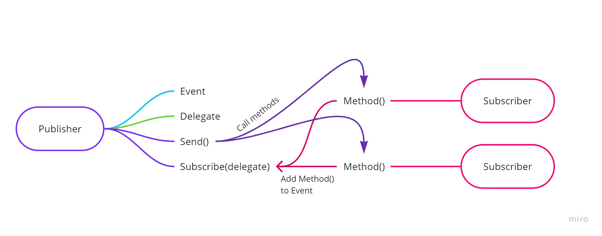

# 🧠 Class 7 – Events and Delegates

Trainer - Full Name Here  

---

## 📌 LOOKING BACK AT...

- What is the difference between Func and Action?  
- What does Func<int, string, string> means?  
- What are the conditions for chaining LINQ methods?  
- What is the difference between Select and SelectMany?  

🤖
```
Explain Func vs Action with simple examples.
```

---

## 📌 AGENDA

- Introduction to delegates  
- Using delegates as anonymous functions  
- Introduction to events  
- Using events and delegates to build subscription models  

---

# Delegates and Events 🥧

---

## WHAT ARE DELEGATES?

A delegate is a definition of a method signature.  
It represents the return type as well as the parameter types.  
A delegate can be implemented by multiple methods if the signature is the same.  

They are usually used for:
- passing methods as parameters  
- anonymous method invocations  

🤖
```
Why would we treat methods as data in C#?
```

---

## Delegates 🔹

Values in C# always have a certain type. Just as values can be represented by a type, so can methods. Delegates are types that represent references to methods. If the method and the delegate share the same signature (Return and parameter types) then the delegate can be instantiated with a method that meets the requirements.

This means that we can use delegates:
- as types for methods  
- as parameters  
- as higher-order functions  

🤖
```
What does it mean for two methods to have the same signature?
```

---

### Delegates in Action

```csharp
// Declaring a delegate
public delegate void SayDelegate(string something);

public static void SayHello(string person)
{
    Console.WriteLine($"Hello {person}!");
}

public static void SayBye(string person)
{
    Console.WriteLine($"Bye {person}!");
}

SayDelegate del = new SayDelegate(SayHello);
SayDelegate bye = new SayDelegate(SayBye);
SayDelegate wow = new SayDelegate(x => Console.WriteLine($"Wow {x}!"));

del("Bob");
bye("Jill");
wow("Greg");
```

🤖
```
Why can multiple methods be assigned to the same delegate?
```

---

### Delegates as parameters

```csharp
public delegate int NumbersDelegate(int num1, int num2);

public static void SayWhatever(string whatever, SayDelegate sayDel)
{
  Console.Write("Chatbot says:");
  sayDel(whatever);
}

SayWhatever("Bob", SayHello);
SayWhatever("Jill", SayBye);
SayWhatever("Greg", x => Console.WriteLine($"Wow {x}!"));
```

---

```csharp
public static void NumberMaster(int num1, int num2, NumbersDelegate numberDel)
{
    Console.WriteLine($"The result is: {numberDel(num1, num2)}");
}

NumberMaster(2, 5, (x, y) => x + y);
NumberMaster(2, 5, (x, y) => x - y);
NumberMaster(2, 5, (x, y) => 0);
NumberMaster(2, 5, (x, y) =>
{
    if (x > y) return x;
    return y;
});
```

🤖
```
How does passing a method as parameter improve flexibility?
```

---

## WHAT ARE EVENTS?

An event can enable a class to notify other classes or instances of classes that something happened.

They are usually used with delegates.

Events can be used:
- to detect UI actions (click, key press)  
- to build subscription systems  

🤖
```
Why do events need delegates?
```

---

## Events 🔹

Events are entities that we can use to notify multiple classes or objects when something happens.

Events:
- use delegates as type  
- allow subscription  
- allow multiple listeners  

🤖
```
What problem do events solve compared to direct method calls?
```

---

## Publisher/Subscriber model 🔹

The publisher-subscriber model is a way to send information to all that want to listen.

- Publisher → sends event  
- Subscriber → listens to event  



🤖
```
Where do we see this pattern in real applications?
```

---

### Publisher

```csharp
public class Publisher
{
  public delegate void DataProcessingDelegate(string message);

  public event DataProcessingDelegate DataProcessingHandler;

  public void ProcessData(string message)
  {
    Console.WriteLine("Processing data...");
    Thread.Sleep(3000);
    WhenDataIsProcessed(message);
  }

  protected void WhenDataIsProcessed(string message)
  {
    if (DataProcessingHandler != null)
    {
      DataProcessingHandler(message);
    }
  }
}
```

🤖
```
Why do we check if event is null before calling it?
```

---

### Subscribers

```csharp
public class Subscriber1
{
    public void GetMessage(string message)
    {
        Console.WriteLine("Subscriber 1 here!");
        Console.WriteLine($"THE MESSAGE IS: {message}");
    }
}

public class Subscriber2
{
    public void GetMessage(string message)
    {
        Console.WriteLine("Subscriber 2 here!");
        Console.WriteLine($"THE MESSAGE IS: {message}");
    }
}
```

---

### Using the model

```csharp
Publisher publisher = new Publisher();
Subscriber1 sub1 = new Subscriber1();
Subscriber2 sub2 = new Subscriber2();

publisher.DataProcessingHandler += sub1.GetMessage;
publisher.DataProcessingHandler += sub2.GetMessage;

publisher.ProcessData("Fancy message");

publisher.DataProcessingHandler -= sub2.GetMessage;

publisher.ProcessData("New message");
```

🤖
```
What happens when we unsubscribe from an event?
```

---

## BUILDING A SUBSCRIPTION IMPLEMENTATION

A subscription implementation is a way for a class to send notification to other classes.

- Publisher raises event  
- Subscribers listen  
- Delegates define communication  

🤖
```
How does this reduce coupling between classes?
```

---

# 🧪 EXERCISE

# 🧪 EXERCISE

Create a Publisher class that:

- Has a delegate that accepts a string message  
- Has an event based on that delegate  
- Has a method ProcessData(string message) that:
  - Simulates some work (can use delay)  
  - Calls a method that raises the event  

---

Create 2 Subscriber classes that:

- Have a method that matches the delegate signature  
- Print the message in their own way  

---

In Main:

- Create publisher  
- Create both subscribers  
- Subscribe both to the event  
- Trigger ProcessData()  
- Unsubscribe one subscriber  
- Trigger ProcessData() again  

---

🤖
```
How does event subscription and unsubscription work internally?
```

```
What happens if no subscribers are attached to the event?
```

```
Why is this pattern useful in real applications?
``` 

```
How should I structure publisher and subscriber step by step?
```

```
What are common mistakes when working with events?
```

---

# ❓ QUESTIONS?

You can find us at  
trainer@mail.com  
