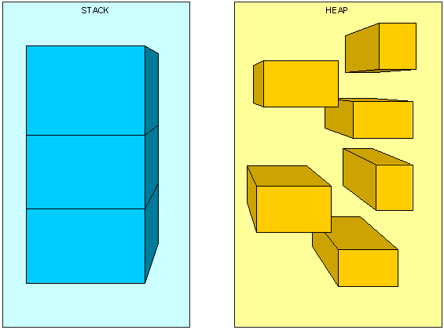
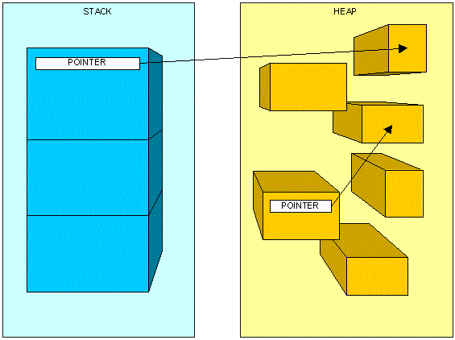
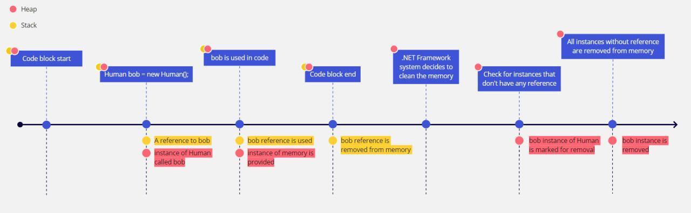

# 🧠 Class 10 – Disposing and Managing Resources

Trainer: Ilija Mitev <br>
Contact: ilija.mitev3@gmail.com

---

## 📌 LOOKING BACK AT... 

- How can we write on file system?  
- What happens when we create a file with File.Create and try writing something in it?  
- What are StreamReader and StreamWriter used for?  

🤖
```text
Explain how writing to a file works in C# step by step.
```

---

## 📌 AGENDA 

- A C# class instance lifecycle  
- What is disposing  
- Using disposable classes  
- Building a custom disposable class  
- What are optional and nullable values  

---

# Disposing and Managing Resources 🍣

---

## Managing resources 🔹

When we are building applications with the C# language, the chances are that we are also doing that in tight collaboration with the .NET framework. This is a unique and powerful combination of syntax, features, libraries, and systems that cooperate in the background to serve and manage our application. One of the things that the .NET Framework does for us, manage its own resources. This means that when we use the classes, methods, and systems from the .NET Framework, it works in the background to track what is used and removes instances that we are not going to use. These resources that are in the scope of the .NET Framework and that are managed automatically are called managed resources.

But we don't always work exclusively with the .NET Framework and its features. Sometimes we need some external resources. This can be a connection to the file system, to a database, to some other server or API, services, etc. These resources are outside of the .NET Framework scope and are not managed automatically. That is why we need to manage them ourselves. These are called unmanaged resources.

🤖
```text
What is the difference between managed and unmanaged resources in C#?
```

---

## Introduction to memory usage

When we are programming and writing code, that code has to be stored somewhere in the memory. This means that it has to take up space somewhere. Since there are different types of entities with different complexity and structure, the code that we write is divided into the Heap and Stack.

---

## Stack

The stack is the memory where we can allocate things that are static. Since the things we store here are static, they are saved directly, and retrieving stored data is very fast. In the stack, we can keep value types such as variables with integers, strings, booleans, etc. The stack also houses all the references to complex types such as instances of classes. This does not mean that it holds the whole instance and the data of the class, it just means that it remembers the address of where the class instance is stored so it can point to it when somebody requests to use it. The stack also tracks the order of the memory allocated (Last In First Out) so all the things that enter the stack are used in the reverse order in which they were added.



🤖
```text
What is stored in the stack and why is it fast?
```

---

## Heap

The heap is the dynamic part of the memory, where we keep the complex types of data such as class instances themselves. This memory is allocated at runtime, meaning that it is a bit slower. Unlike the stack, the heap has no particular order and we can access and use any entity in the heap at any time. With that said, allocating memory here can be done at any time and that memory can be cleared at any time. As we said, we store the instances of classes (objects) in the heap. When a new instance is created, the memory is allocated in the heap and the data for that object is stored. In the stack, an address pointing to that memory location is saved. When we call that address it points to the object in the heap and we can access it, change it. Luckily we don't have to constantly worry about the heap since the .NET Framework manages most of the heap automatically.



🤖
```text
Why is heap memory managed by the .NET framework?
```

---

## A C# Object life cycle



🤖
```text
Explain what happens to an object after it is no longer referenced.
```

---

## Disposable 🔹

We mentioned that throughout our development process we can encounter some resources that are not managed automatically. Those unmanaged resources need to be managed manually. The process of releasing those resources that we allocated is called disposing or disposable. Unmanaged resources can lead to slow application, running out of available resources, and even blocking our application. The classes that support this system of disposing always inherit from the `IDisposable` interface. In the .NET Framework, classes that work with an outside source are always classes that can be disposed of.

🤖
```text
Why is IDisposable important when working with external resources?
```

---

## Disposing manually

```csharp
public void AppendTextInFile(string text, string path)
{
  StreamWriter sw = new StreamWriter(path, true);

  if (text == "break") throw new Exception("Something broke unexpectedly...");

  sw.WriteLine(text);
  sw.Dispose();
}
```

🤖
```text
What are the risks of manually calling Dispose()?
```

---

## Disposing with Using Block

```csharp
public void AppendTextInFileSafe(string text, string path)
{
  using (StreamWriter sw = new StreamWriter(path, true))
  {
    if (text == "break") throw new Exception("Something broke unexpectedly...");
    sw.WriteLine(text);
  }
}
```

🤖
```text
Why is using block safer than manual disposing?
```

---

## Building a disposable class 🔹

```csharp
public class OurWriter : IDisposable
{
    private string path;
    private StreamWriter _sw;
    private bool disposedValue = false;

    public OurWriter(string filePath)
    {
        path = filePath;
        _sw = new StreamWriter(path, true);
    }

    public void Write(string text)
    {
        if (text == "break") throw new Exception("Something broke unexpectedly...");
        _sw.WriteLine(text);
    }

    private void _dispose(bool disposing)
    {
        if (!disposedValue)
        {
            if (disposing)
            {
                _sw.Dispose();
            }

            path = "";
            disposedValue = true;
        }
    }

    public void Dispose()
    {
        _dispose(true);
    }
}
```

🤖
```text
Why do we track disposedValue in custom disposable classes?
```

---

## Nullable values 🔹

Nullable means that the type will accept values from its context as well as null.

```csharp
public class Person
{
    public int Id { get; set; }
    public int? Score { get; set; }
    public string Name { get; set; }
}
```

```csharp
Person prs = new Person();

Console.WriteLine(prs.Id);
Console.WriteLine(prs.Score);
Console.WriteLine(prs.Score == null);
Console.WriteLine(prs.Name);
Console.WriteLine(prs.Name == null);

prs.Score = null;
```

🤖
```text
Why are nullable types useful in real applications?
```
