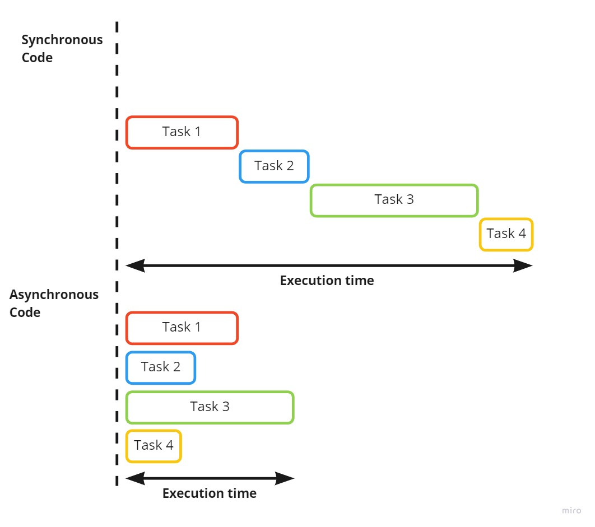
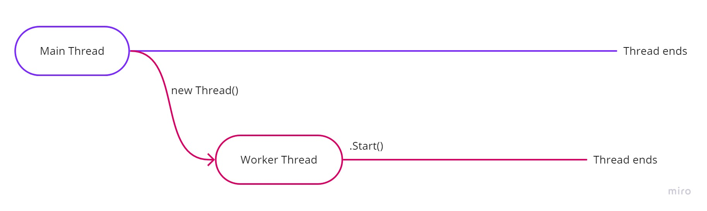
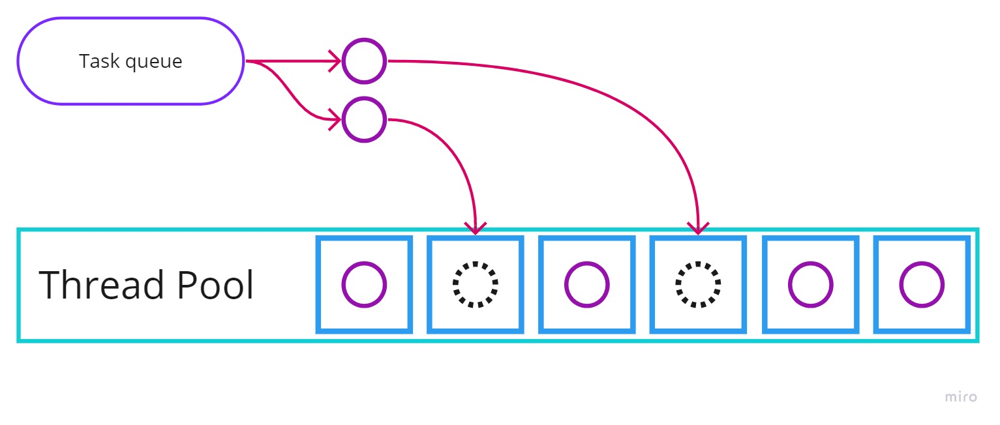

# 🧠 Class 12 – Asynchronous Programming in C#

Trainer: Ilija Mitev <br>
Contact: ilija.mitev3@gmail.com

---

## 📌 LOOKING BACK AT... 

- What is serialization and deserialization?  
- Which nuget library we can use for working with JSON?  

🤖
```text
Explain serialization and deserialization with a real example.
```

---

## 📌 AGENDA 

- Asynchronous execution in C#  
- What are threads?  
- What are tasks?  
- Using async/await  

---

# Asynchronous Programming with C# 🍥

---

## WHAT IS ASYNCHRONOUS EXECUTION?

Asynchronous execution is when multiple things can work without waiting on each other to finish.

Synchronous execution is when things are executed one after the other and always wait on each other to finish.

We can write asynchronous code in C# using different features.

🤖
```text
Explain synchronous vs asynchronous execution with real-world analogy.
```

---

## Asynchronous execution 🔹

When programming, we expect the code to be executed in order.

But sometimes waiting blocks the application.

Example:
- waiting for server  
- waiting for file  
- waiting for API  

Async allows:
- multiple execution flows  
- non-blocking behavior  



🤖
```text
Why is blocking code bad for performance?
```

---

## Threads 🔹

A thread is the execution path of the program.

- Main thread → default execution  
- Additional threads → parallel work  

When async starts:
- new thread can execute work  



🤖
```text
What is the role of the main thread in an application?
```

---

### Synchronous example

```csharp
public static void SendMessages()
{
    Console.WriteLine("Getting Ready...");
    Thread.Sleep(2000);

    Console.WriteLine("First message arrived!");
    Thread.Sleep(2000);

    Console.WriteLine("Second message arrived!");
    Thread.Sleep(2000);

    Console.WriteLine("Third message arrived!");
    Console.WriteLine("All messages are received!");

    Console.ReadLine();
}
```

---

### Asynchronous with Threads

```csharp
public static void SendMessagesWithThreads()
{
    Console.WriteLine("Getting Ready...");

    new Thread(() =>
    {
        Thread.Sleep(2000);
        Console.WriteLine("First message arrived!");
    }).Start();

    new Thread(() =>
    {
        Thread.Sleep(2000);
        Console.WriteLine("Second message arrived!");
    }).Start();

    new Thread(() =>
    {
        Thread.Sleep(2000);
        Console.WriteLine("Third message arrived!");
    }).Start();

    Console.WriteLine("All messages are received!");
    Console.ReadLine();
}
```

🤖
```text
What is the difference between synchronous and threaded execution?
```

---

## Tasks 🔹

Tasks represent work that needs to be done.

- queued in thread pool  
- executed efficiently  
- track status  



🤖
```text
What is the difference between Task and Thread?
```

---

### Task example

```csharp
Task myTask = new Task(() =>
{
    Thread.Sleep(2000);
    Console.WriteLine("Running after 2000ms");
});

myTask.Start();
```

---

### Task with result

```csharp
Task<int> valueTask = new Task<int>(() =>
{
    Thread.Sleep(2000);
    Console.WriteLine("We can now get the number...");
    return 6;
});

valueTask.Start();
Console.WriteLine(valueTask.Result);
```

🤖
```text
What happens when we access Task.Result?
```

---

## Async / Await 🔹+

Async methods:
- return Task  
- allow non-blocking execution  

Await:
- waits for result  
- does not block thread  

---

### Example

```csharp
public static async Task SendMessageAsync(string message)
{
    Console.WriteLine("Sending message...");

    await Task.Run(() =>
    {
        Thread.Sleep(7000);
        Console.WriteLine($"The message {message} was sent!");
    });
}
```

---

```csharp
public static void ShowAd(string product)
{
    Console.WriteLine("While you wait let us show you an ad:");
    Console.WriteLine($"Buy {product} now!");
}
```

---

```csharp
var task = SendMessageAsync("Hello!");
ShowAd("Potato");

Console.WriteLine(task.Status);
```

🤖
```text
Why does ShowAd run before the message is sent?
```

---

## USING THREADS (PPT)

A thread is the basic unit to which processor time is allocated.

We can use Thread class to run code asynchronously.

---

## USING TASKS (PPT)

Tasks:
- represent work  
- managed by thread pool  
- track execution status  

---

## ASYNC / AWAIT (PPT)

- await works only in async methods  
- async methods return Task  
- async improves readability  

🤖
```text
Why is async/await preferred over manual threads?
```

---

## 🧪 EXERCISE

Create:

- method that simulates long-running operation  
- method that prints something instantly  

---

Run both:

- synchronous → observe delay  
- asynchronous → observe difference  

---

🤖
```text
How can I test async vs sync behavior in console app?
```

```
What are common mistakes when using async/await?
```

```
When should I NOT use async?
```

---

## Extra Materials 📘

- Threads in C#  
- Task-based async programming  
- Async/await guide  

---