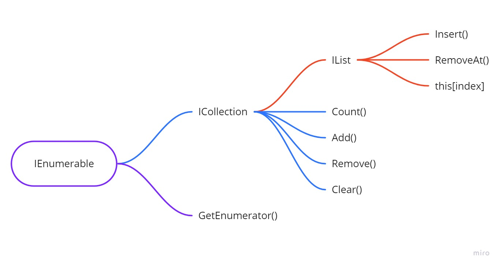

# 🧠 Class 6 – Anonymous Methods and Advanced LINQ

Trainer - Tijana Stojanovska 

---

## 📌 LOOKING BACK AT... 

- What are generic methods?  
- How can we use generic classes?  
- Can we create a non-static extension method?  
- What is piggybacking and why is it used?  

🤖
```
Explain generics and extension methods in simple terms.
```

---

## 📌 AGENDA 

- Introduction to anonymous methods  
- Using Func and Action  
- Func and Action along with LINQ  
- Advanced queries with LINQ  

---

# Anonymous functions and LINQ 🍣

---

## Anonymous functions 🔹

### Lambda expression

Lambda expression is a short and easy way of writing anonymous functions...

🤖
```
Why are lambda expressions preferred over normal methods in many cases?
```

---

```csharp
List<string> names = new List<string>()
{
    "Bob", "Jill", "Wayne", "Greg", "John", "Anne"
};
List<string> empty = new List<string>();
```

---

```csharp
string foundBob = names.Find(x => x == "Bob");
```

🤖
```
What does x => x == "Bob" represent?
```

---

## ANONYMOUS METHODS

- Anonymous methods are methods that contain just a method body  
- In C#, if we want to store an anonymous method we still need a method type  
- Func and Action are used to keep different types of anonymous functions  
- Anonymous methods are usually used when working with LINQ  

🤖
```
What is the difference between lambda expression and anonymous method?
```

---

## Func with lambda expression

#### No parameters Func

```csharp
Func<bool> isNamesEmpty = () => names.Count == 0;
Console.WriteLine($"IsNamesEmpty: {isNamesEmpty()}");
```

---

#### Two parameters Func

```csharp
Func<int, int, int> sum = (x, y) => x + y;
Console.WriteLine($"sum: {sum(2, 3)}");
```

🤖
```
Why does Func define return type as the last parameter?
```

---

## Action with lambda expression

#### No parameters Action

```csharp
Action hello = () => Console.WriteLine($"Hello there!");
hello();
```

---

#### Two parameters Action

```csharp
Action<string, ConsoleColor> printColor = (x, y) =>
{
    Console.ForegroundColor = y;
    Console.WriteLine(x);
    Console.ResetColor();
};
```

🤖
```
What is the difference between Action and Func?
```

---

## DIFFERENCE BETWEEN ACTION AND FUNC

- Action is an anonymous method with parameters which are generic that does not return anything  
- Func is an anonymous method that returns something  
- Func always defines the return type last  

🤖
```
When should I use Action vs Func?
```

---

## Using Func and Action in LINQ

We can save method templates in Func and then pass them to LINQ chains...

🤖
```
Why would we store a lambda in Func instead of writing it inline?
```

---

```csharp
Func<string, bool> IsBob = x => x == "Bob";
string foundJill = names.FirstOrDefault(IsBob);
```

---

# LINQ 🔹

As we know LINQ (Language Integrated Query) is a dynamic and advanced syntax...

🤖
```
Why is LINQ considered powerful compared to normal loops?
```

---



🤖
```
What is IEnumerable and why is it important in LINQ?
```

---

## Setup

```csharp
public class Student
{
    public string FirstName { get; set; }
    public string LastName { get; set; }
    public int Age { get; set; }
    public bool IsPartTime { get; set; }
    public List<Subject> Subjects { get; set; }
}
```

---

## Where

- Where filters items  
- Returns IEnumerable  

```csharp
IEnumerable<Student> findBobsLambda = SEDC.Students
.Where(x => x.FirstName == "Bob");
```

🤖
```
Why does Where return IEnumerable and not List?
```

---

## Select

```csharp
List<string> firstNamesLambda = SEDC.Students
.Select(x => x.FirstName).ToList();
```

🤖
```
What is the difference between Select and Where?
```

---

## Complex query

```csharp
List<Student> ptProgrLambdaQuery = SEDC.Students
.Where(x => x.IsPartTime)
.Where(x => x.Subjects
    .Where(y => y.Type == Academy.Programming)
.ToList().Count != 0)
.ToList();
```

🤖
```
How does nested LINQ query work?
```

---

## First / FirstOrDefault

```csharp
Student student1 = SEDC.Students.First();
Student student2 = SEDC.Students.FirstOrDefault();
```

🤖
```
What happens if First() does not find a value?
```

---

## Last / LastOrDefault

```csharp
Student student1 = SEDC.Students.Last();
Student student2 = SEDC.Students.LastOrDefault();
```

---

## Single / SingleOrDefault

```csharp
Student student1 = SEDC.Students.Single();
Student student2 = SEDC.Students.SingleOrDefault();
```

🤖
```
What is the difference between First and Single?
```

---

## SelectMany

```csharp
List<Subject> partTimeSubjectsMany = SEDC.Students
.Where(x => x.IsPartTime)
.SelectMany(x => x.Subjects).ToList();
```

🤖
```
Why do we use SelectMany instead of Select here?
```

---

## Distinct

```csharp
List<Subject> distinctSubjects = partTimeSubjectsMany.Distinct().ToList();
```

---

## Any

```csharp
bool isBob = SEDC.Students
.Any(x => x.FirstName == "Bob");
```

---

## All

```csharp
bool areThereShortNames = SEDC.Students
.All(x => x.FirstName.Length >= 3);
```

---

## Except

```csharp
List<Student> exceptPartTime = SEDC.Students
.Except(SEDC.Students.Where(x => x.IsPartTime)).ToList();
```

---

## OrderBy / ThenBy

```csharp
List<Student> sortedStudents = SEDC.Students
.OrderBy(x => x.FirstName).ThenBy(x => x.Age).ToList();
```

🤖
```
How does chaining LINQ methods work?
```

---

# 🧪 EXERCISE 

Find and print:

- All persons firstnames starting with 'R', ordered by Age DESC  
- All brown dogs older than 3 years  
- All persons with more than 2 dogs  
- All Freddy’s dogs older than 1 year  
- Nathen’s first dog  
- All white dogs from Cristofer, Freddy, Erin and Amelia  

🤖
```
How should I approach writing LINQ queries step by step?
```

```
What is the best way to test complex LINQ queries?
```

---

# ❓ QUESTIONS?

You can find us at  
stojanovska_tijana@outlook.com
